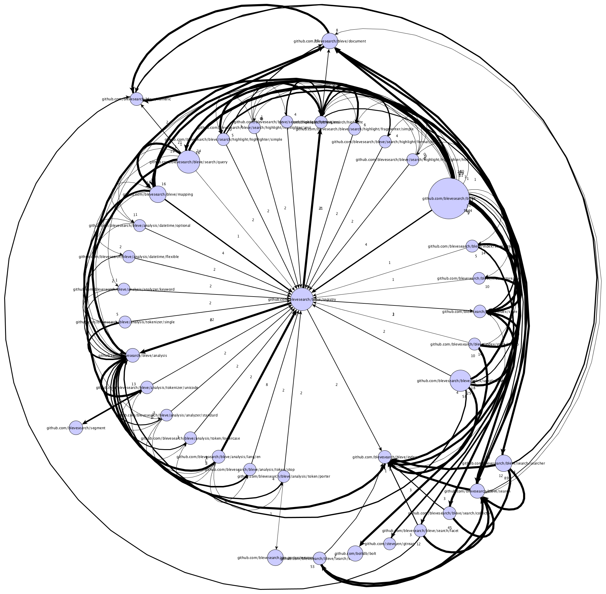

# grapher
Yet Another Tool for Analyzing Go Packages

## Overview
Grapher focuses on
analyzing sizes of Go packages (in terms of functionality) and weights of
inter-package dependencies. Finally, all package links can be checked against constraints
using logic programming.

Given these properties, Grapher is intended to aid code reviews and code analysis. I have used it to
understand our own code base at [Wireless Registry](http://www.wirelessregistry.com) that spans 
multiple endpoints, micro-services, and frameworks. The graphs helped me
identify "god-like" packages, unintended (either weak or strong) dependencies, as well as dead packages. 
Once anomalies are found, I encode them as formal constraints, and they are added to our automated testing suite. 
The constraints can encode package hiding (see Bleve example below), package layers, etc. 

In detail, Grapher constructs the following graph:

1. Nodes are packages.
2. The size of a node represents the number of functions declared in that package, normalized across all packages.
3. Directed edges represent package imports.
4. Edge weights represent the number of times the imported package has been used in variable definitions and function calls. 

The output consists of two declarative specifications:

1. [GraphML](http://graphml.graphdrawing.org/) specification
2. [Prolog](https://en.wikipedia.org/wiki/Prolog) program. 

These outputs form the basis for graph analysis and constraint checking over the package graph.

The generated GraphML spec can be examined by [yEd](http://www.yworks.com/products/yed). We can apply different grouping algorithms
to find package clusters and outliers. This can help confirm/refute different hypothesis that we may have about our code base.
For example, lack of distinct clusters indicate a code base with no structure and layering, a high number of outliers may indicate
a need to combine different packages, etc. Finally, we can also look at two centrality measures: _edge_ and _betweeness_, to 
find influential nodes and confirm whether the code base should in fact have super nodes.

The generated Prolog program contains the declarative specification
of the package dependencies, and the directory structure. We can then add constraints to check whether the logical separation of packages within
different layers (such as _endpoints_, _services_, _frameworks_, etc) is broken with the respect to the dependency structure. Clearly, this
analysis only applies if the code base has some logical groupings amongst packages, and the code is not allowed to flow from _high_ packages
(e.g. endpoints) to _low_ packages (e.g. crypto).

Note, I use [Swi-Prolog](http://www.swi-prolog.org/) (an easy-to-install Prolog interpreter) to run constraints checks.

## Usage and Examples
Flags:
* _pkgs_ : starting _root_ packages
* _outputFile_ : file name for the two output files. The output extensions are _.graphml_ and _.pl_
* _permit_ : regex pattern that has to be part of the package name in order to include it in the graph
* _deny_ : regex pattern that must not be part of the package name in order to include it in the graph
* _includeStdLib_ : include stdLib packages in the graph

Given a package named `n`, then `n` is included in the graph unless either: 1) the permit filter is set, and the filter does not match `n`, 
or 2) the deny filter is set, and the filter does match `n`.

### Dependencies
1. [go loader tool](https://godoc.org/golang.org/x/tools/go/loader)

### Running grapher on itself
Simple usage examples of running grapher on its own package structure:
	
`grapher -pkgs=github.com/a-little-srdjan/grapher -output=grapher` 

`grapher -deny="x|vendor" -pkgs=github.com/a-little-srdjan/grapher -output=grapher-no-x` 

Unsurprisingly, there is not a lot of excitement in these diagrams :) They are, however, useful to note the key graphing elements. Firstly,
note how smaller in functionality grapher packages are compared to the _tools_ packages (as one would expect). Secondly, the grapher package 
is very small compared to the rest of the grapher code. Thirdly, the grapher packages form a strong cluster.  

### Running grapher on Bleve
To spice up the examples, we now run grapher on [Bleve](https://github.com/blevesearch/bleve), a search system ala Lucene written entirely in Go.

`grapher -deny="golang|vendor" -pkgs=github.com/blevesearch/bleve -output=resources/bleve`

We then open the output GraphML file in yEd to create different layouts.

The graph above is laid out with the _radial_ layout. The graphs are best explored in yEd, the pictures are merely here for illustrations.
It is interesting to note that the registry package is a central node in the cluster, even though the top package bleve has most functionality and most dependencies.
The picture suggests that the analysis package could embed the registry package. This would make the analysis package most central to bleve.

Interesting to note is that the 
top level bleve package has very few dependencies to the analysis packages, as opposed to the search packages.

The _natural_ layout brings out super nodes in a graph. The graph above specifically reveals the registry package as a super node.

The _circular_ layout is akin to the _chord_ layout often seen in [D3](https://github.com/d3/d3-chord).

#### Checking Bleve's constraints

Arguably, most code bases have stronger (logical) constraints than acylicity (enforced by Go itself). For example, informally a Bleve developer told me
that the index package should not import any of the children of the analysis package. Similarly the search package ought not to import any of the children 
of the index package, except for the store package. These logical constraints ensure that correct interfaces are used and not their concrete instantiations.
There is currently no way to make such enforcements in Go, since either a functionality is strictly private or fully public. 

Note, I do not think that Go should implement additional features for this, I strongly believe that these checks, given that they are necessarily tied to a 
particular code base, ought to always be checked using analysis.

Coming from the computational logic world, it felt natural to pick Prolog as a language to encode constraints, as well as perform graph reasoning 
(given that Prolog is geared towards transitional closures). I accept that this choice can be disputed. The first constraint that we encode is:

	violation("bleve", Y) :- dependency(Y, "github.com/blevesearch/bleve").
 
It says that a violation named _bleve_ occurs whenever some package imports the bleve package. The way Prolog reasons about constraints is that it will try
to find a particular dependency in the graph that will satisfy the body of the above statement. If it fails to find it, the violation is marked as false.
For intros and explanations on Prolog please see [link](http://www.doc.gold.ac.uk/~mas02gw/prolog_tutorial/prologpages/).  

In a similar fashion, we can encode further violations:

	violation("searching", Y) :- dependency("github.com/blevesearch/bleve/search", Y), nested("github.com/blevesearch/bleve/index", Y).
	violation("indexing", Y) :- dependency("github.com/blevesearch/bleve/index", Y), nested("github.com/blevesearch/bleve/analysis", Y).

The _searching_ violation happens if there is a package nested in index that search (transitively) depends on. The second follows a similar idea.
We also have to encode one exception for the searching violation namely:

	exception("searching", "github.com/blevesearch/bleve/index/store").

Now, we can say that constraints are broken if there are violations and no exceptions:

	broken(X, Y) :- violation(X, Y), \+ exception(X, Y). 

To check for any broken constraints, we can invoke SWI-Prolog:

	swipl resources/bleve.pl resources/bleve_graph_constraints.pl 

and enter the following query:

	:- broken(X, Y).
 
This will list broken constraints if there are any.

## Planned Work
1. Increase the edge weights with method calls. That is, currently, expressions such as
`varName.Method()` are not taken into account for edge weights.
2. Build a graph of functional dependencies within a package.  

## Related Work
* [goviz](https://github.com/hirokidaichi/goviz)
* [Visualising dependencies](https://dave.cheney.net/2014/11/21/visualising-dependencies) by Dave Cheney
* [Building the simplest Go static analysis tool](https://blog.cloudflare.com/building-the-simplest-go-static-analysis-tool/) by Filippo Valsorda

## Feedback
Please send all comments and suggestions to _srdjan.marinovic@gmail.com_
